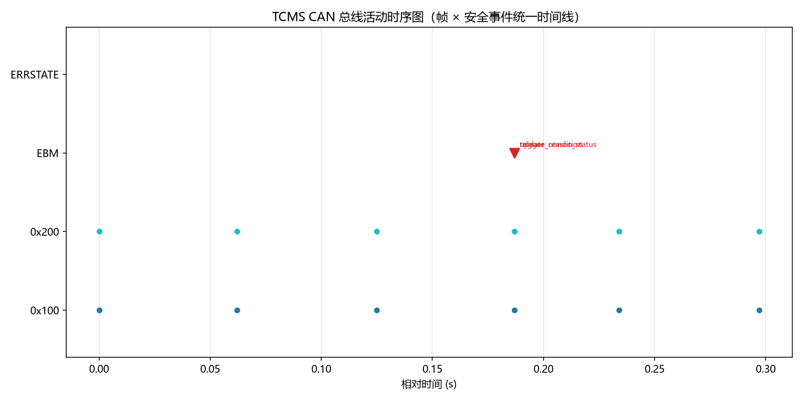

# TCMS-CAN-Test — 列车网络控制（TCMS）CAN 报文自动化测试框架

[](https://github.com/zych2002918/tcms-can-test/actions)
[](#)
[](#)
[](#)
[](#)

针对轨道交通列车网络控制系统（TCMS / 列车控制管理系统）的 CAN 总线报文自动化测试框架。

通过**虚拟 CAN 总线 + DBC 协议数据库 + 报文仿真器（被测对象 DUT）**，对列车控制报文的
**周期、ID 合法性、信号值域、边界值、枚举、事件联动、丢报检测、安全联锁逻辑、紧急制动管理、
CAN 错误状态机、事件时序记录**进行自动化验证，输出结构化测试报告。无硬件依赖，可本地运行，可接入 CI。

```
┌─────────────────────┐  发送  ┌──────────────────┐  采集/断言   ┌─────────────────┐
│  TCMSNodeSimulator   │ ─────▶ │ 虚拟 CAN 总线       │ ───────────▶ │ pytest 测试套件    │
│  MultiNodeSimulator  │        │ (python-can virtual)│             │  268 个用例       │
│  （被测系统 DUT）    │        └──────────────────┘             └─────────────────┘
└─────────────────────┘          故障注入：节点失活 / 停止发送 / 越界 / 抖动 / 事件 / 总线错误
```

## 功能特性

| 模块 | 说明 |
|------|------|
| `dbc/tcms.dbc` | 列车控制网络协议数据库：8 个报文（心跳/车速/牵引制动/车门/报警/受电弓/制动/能源），含周期属性与枚举值表 |
| `tcms/simulator.py` | 单节点 TCMS 仿真器：按 DBC 周期（50/100/500ms）自动发送周期报文，支持事件报文与故障注入 |
| `tcms/multinode.py` | **多节点总线仿真**：VCU（主控）/BCU（制动）/BMS（能源）独立节点，支持节点级失活与恢复（断电/通信中断场景） |
| `tcms/interlocks.py` | 列车安全联锁逻辑（测试视角规则）：门-车联锁、超速-制动联锁、受电弓异常、能源联锁 |
| `tcms/ebm.py` | **紧急制动管理（EBM）**：驾驶模式×制动原因×处置矩阵决策 + 缓解/复位闭环，SIL2/SIL4 双通道表决 |
| `tcms/errstate.py` | **CAN 错误状态机**：对标 ISO 11898-1 的 TEC/REC 错误计数器、Error-Active/Passive/Bus-Off 迁移、128 次总线空闲恢复、损坏帧统计 |
| `tcms/recorder.py` | **事件时序记录器**：环形缓冲统一时间线（帧/EBM/错误事件），RecordedBus 装饰器、过滤查询、统计、JSON/CSV 导出 |
| `scripts/plot_timeline.py` | **时序甘特图**：时间×帧ID/事件泳道可视化（matplotlib，输出 docs/timeline_demo.png） |
| `tcms/parser.py` | 报文采集与解码辅助：周期统计、丢报检测 |
| `tests/` | **268 个自动化用例**，覆盖七层：协议静态验证、仿真器行为、故障注入与边界值、安全联锁逻辑、多节点总线、紧急制动管理、CAN 错误状态机与事件记录 |

## 快速开始

```bash
python -m venv .venv
.venv/Scripts/activate            # Windows；Linux/macOS: source .venv/bin/activate
pip install -r requirements.txt
python run.py                     # 运行全部测试 + 生成 report.html
```

一键入口：

```bash
python run.py                     # 全部测试 + HTML 报告
python run.py --allure            # 额外生成 Allure 结果
python run.py --coverage         # 生成代码覆盖率报告（htmlcov/）
python run.py -k door             # 按关键字筛选用例
python run.py --no-report         # 只跑测试
```

生成 Allure 报告（需安装 [allure 命令行](https://allurereport.org/docs/install/)）：

```bash
pytest tests/ --alluredir=allure-results
allure serve allure-results
```

## 测试用例设计（268 个）

**协议静态验证（`test_protocol.py`）**：DBC 结构完整性、报文 ID 唯一性与标准帧约束、
DLC、周期属性（50/100/500ms）、报警事件型配置、信号物理值域（车速 0-200km/h、
SOC 0-100%、温度 -40~120℃）、枚举值表、节点表。

**仿真器行为（`test_simulator.py`）**：7 个周期报文在总线上齐发、心跳/手柄周期实测、
心跳计数器单调递增、车速设置-解码往返一致、牵引/制动联动逻辑、车门状态与
AllDoorsClosed/开门许可联动、报警事件触发与解码、丢报注入。

**故障注入与边界值（`test_fault_injection.py`）**：车速/手柄/SOC/温度边界值编码与
越界拒绝、超速→报警事件联动（>160km/h）、心跳丢失检测、单报文丢失不影响其他报文、
时钟抖动下计数器完整性、车门故障安全（AllDoorsClosed 不得置位）、原始帧往返无损、
未知报文 ID 拒绝解码。

**安全联锁逻辑（`test_interlocks.py`）**：门-车联锁（开门/故障状态下移动即违规）、
超速判定边界（160km/h 含等于不触发）、紧急制动决策矩阵、受电弓拉弧风险
（电压异常 + 弓升）、SOC 能源联锁。

**多节点总线（`test_multinode.py`）**：节点-报文归属映射完整性、节点级失活隔离
（BMS 失活仅影响能源报文）、BCU 失活隔离、节点恢复后报文重新出现、未知节点拒绝。

**紧急制动管理（`test_ebm.py`）**：模式×原因矩阵穷举（8 原因 × FAM/CM/RM 3 模式）、
触发→缓解→复位闭环、自愈复位限次与远程复位、降级链模式迁移（FAM→CM→RM 单步合法、
跳级拒绝）、SIL2/SIL4 双通道表决、非法输入健壮性。

**CAN 错误状态机（`test_errstate.py`）**：TEC/REC 计数规则（+8/-1/被动跳变 120/119）、
Error-Passive 阈值迁移（128）、Bus-Off 触发（TEC≥256）与离线隔离、128 次总线空闲恢复、
计数器 8 位封顶、错误类型统计、状态迁移回调、混合错误-成功震荡、软件复位。

**事件时序记录器（`test_recorder.py`）**：环形缓冲容量与淘汰、类型/ID/方向/类别/时间段/
关键词过滤查询、统计聚合、JSON/CSV 导出（UTF-8 无 BOM）、RecordedBus 收发帧透明记录、
EBM/错误状态机 hook 接线、统一时间线完整性与可序列化。

**属性测试（`test_properties.py`，hypothesis）**：以不变量验证替代逐例验证——
错误计数器范围与账目恒等、Bus-Off 隔离与恢复归零、状态-计数一致性、
EBM 触发-适用性-动作逐项吻合、任意操作序列后模式/状态合法、联锁违规⟺原因非空、
阈值单调、环形缓冲容量上限与查询只读性。

## 紧急制动管理（EBM）

对标真实 TCMS 的"紧急制动原因表"：同一原因在不同驾驶模式下处置不同，
紧急制动决策按 **模式 × 原因处置矩阵** 查表，并完成"触发 → 缓解 → 复位"闭环。
对应降级链：ATO 故障 FAM→CM，ATP 故障 CM→RM（不允许跳级）。

| 原因 | FAM | CM | RM | 处置 | SIL |
|------|-----|-----|-----|------|-----|
| 超速 overspeed | ✔ | ✔ | ✔ | 紧急制动 | 4 |
| 车门打开 door_open | ✔ | ✔ | ✘ | 紧急制动 | 4 |
| ATO 故障 ato_fault | ✔ | ✘ | ✘ | 紧急制动 + 降级 CM | 2 |
| ATP 故障 atp_fault | ✔ | ✔ | ✘ | 紧急制动 + 降级 RM | 4 |
| 障碍物 obstacle | ✔ | ✔ | ✘ | 紧急制动 | 4 |
| 火灾报警 fire_alarm | ✔ | ✔ | ✔ | 紧急制动 | 2 |
| 维护开关 maintenance_sw | ✔ | ✔ | ✔ | 紧急制动 | 4 |
| 网络丢失（硬线备份）hardwire_loss | ✔ | ✔ | ✔ | 紧急制动 | 4 |

> ✘ = 原因不适用于该模式：只记录提示（`record_only`），**不误制动**。
>
> 设计说明（面试点）：RM（限制人工）模式下车门/障碍物类原因豁免矩阵制动，理由是 RM 由司机人工确认操作（对标真实列控的运营豁免）；但豁免不等于无防护——`interlocks.py` 的门-车联锁仍按"故障门不得移动"兜底，两层防护职责分离。

**缓解/复位闭环**：

```
         (适用原因触发)                 (零速 ≤0.5km/h 且原因消失)      (远程/人工复位)
IDLE ─────────────────────▶ BRAKE ───────────────────────────────▶ RELEASED ──────────▶ IDLE
 ▲                           │  ▲
 │        (自愈复位·限1次)      │  │ (第 2 次自愈被拒)
 └───────────────────────────┘  ▼
                            FAULT ──────(远程复位)──────▶ IDLE
```

**双通道表决设计**（面试亮点）：
- **SIL4**（超速/ATP 故障/门开等）：两路独立通道**任一触发即制动**——故障安全，
  制动的失效代价远高于误制动，宁可错杀不可漏放；
- **SIL2**（ATO 故障/火灾报警）：**双通道一致才制动**——防误报，
  避免传感器偶发噪声导致无谓紧急制动；

**自愈策略**：自愈复位限 1 次，超限转入 FAULT，之后必须远程/人工复位——
对标真实系统的恢复策略。

## CAN 错误状态机（errstate）

对标 **ISO 11898-1 错误管理**：每个节点维护发送错误计数 TEC 与接收错误计数 REC，
按计数落入 Error-Active / Error-Passive / Bus-Off 三态。规则与标准对齐：

| 事件 | TEC 变化 | REC 变化 |
|------|---------|---------|
| 检出发送错误 | +8 | — |
| 检出接收错误 | — | +8 |
| 成功发送（TEC<128） | −1 | — |
| 成功发送（TEC≥128） | 置 120（被动快速回归） | — |
| 成功接收（REC≥128） | — | 置 119（被动快速回归） |
| TEC ≥ 256 | **Bus-Off**（8 位封顶 255 存储） | — |
| Bus-Off 后累计 128 次总线空闲 | 归零复位 Error-Active | 归零复位 |

设计要点：
- **Bus-Off 离线隔离**：Bus-Off 期间节点不感知总线，所有事件注入均为 no-op——
  对真实节点"离线即失聪"的行为建模；
- **接收错误不触发 Bus-Off**（ISO 11898-1：Bus-Off 仅由发送错误引发）；
- 按错误类型（位/填充/CRC/格式/ACK）统计损坏帧——对应 CANoe 等工具的总线错误统计；
- 状态迁移回调（`on_state_change` / `add_state_listener`）供记录器/监控接线。

## 事件时序记录器（recorder）

对标 CAN 分析工具的 Logging/Trace 与轨道交通信号系统"事件记录器"（EN 50128 语境下
安全事件的可追溯性）：**帧流量与安全事件共享一条统一时间线**。

- `EventRecorder`：环形缓冲（deque maxlen，长跑内存不膨胀），统一 `record_event` 入口；
- `RecordedBus`：python-can 总线装饰器，收发帧透明入库（节点/方向/DLC/数据十六进制）；
- `hook_ebm` / `hook_errstate`：把紧急制动动作与错误状态迁移接入时间线（模块零改动，
  职责单向）；
- 过滤查询（类型/仲裁 ID/方向/类别/时间段/关键词）、聚合统计（按类型/方向/ID/字节数）、
  JSON/CSV 导出（UTF-8 无 BOM，CSV 兼容 Excel）。

**时序可视化**：`scripts/plot_timeline.py` 生成时间×帧ID/事件泳道甘特图
（`docs/timeline_demo.png`），直观呈现"错误积累 → 制动触发 → 缓解"的安全事件序列与
总线流量的时序关系。



## 面试/演示

```bash
python demo.py
```

一键跑通全场景：**多节点仿真启动 → 超速报警 → BMS 节点失活 → 心跳看门狗判离线 → 节点恢复 →
紧急制动管理（ATO 故障降级 CM → 零速缓解 → 远程复位）→ CAN 错误状态机（TEC 越阈转入
Error-Passive）+ 事件记录器（帧/EBM/错误事件统一时间线）**，
输出纯文本流程（正常工况帧数、故障隔离验证、看门狗状态迁移、EBM 处置矩阵闭环、
时间线事件统计与明细），可直接用于现场演示。

## CI

GitHub Actions（`.github/workflows/ci.yml`）：Python 3.10/3.11/3.12 矩阵，
每次 push / PR 自动运行全部测试 + 覆盖率检查。

## 技术栈

Python · python-can（虚拟 CAN）· cantools（DBC 解析/编码）· pytest · pytest-cov（覆盖率 97%）·
hypothesis（属性测试）· matplotlib（时序可视化）· pytest-html · Allure · GitHub Actions

## 后续规划

- [x] CRC-8 校验与错误/位翻转注入
- [x] 节点生命周期状态机
- [x] 紧急制动管理（模式×原因×处置矩阵 + 缓解/复位闭环，SIL2/SIL4 双通道表决）
- [x] CAN 错误状态机（TEC/REC、Bus-Off）仿真（对标 ISO 11898-1）
- [x] 事件时序记录器（环形缓冲统一时间线 + 过滤查询 + JSON/CSV 导出）
- [x] 时序甘特图可视化（时间×帧ID/事件泳道）
- [ ] 真实 CAN 硬件适配（PCAN / 周立功）
- [ ] 列车门控/超速逻辑状态机可视化

## 说明

本项目为学习/求职展示用途的轨道交通测试工具，报文协议为模拟设计，非真实车型协议。