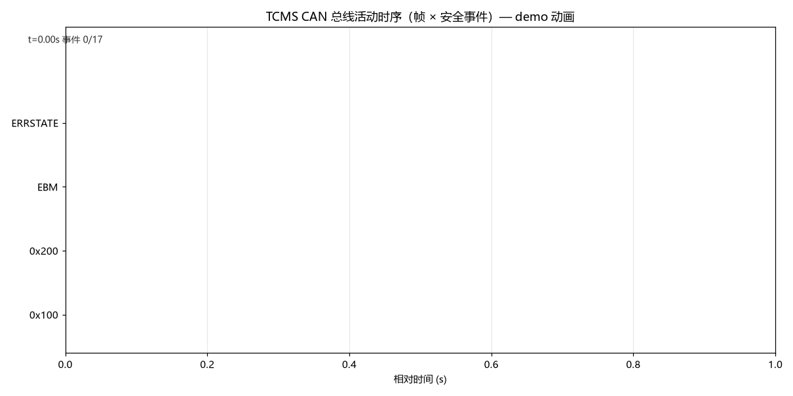

# TCMS-CAN-Test — 列车网络控制（TCMS）CAN 报文自动化测试框架

<!-- badges:start -->
[](https://github.com/zych2002918/tcms-can-test/actions)
[](#)
[](https://github.com/zych2002918/tcms-can-test/blob/main/LICENSE)
[](docs/safety_case.md)
[](#) [](#)
<!-- 自证：tests=777 (skipped 1, failures 0, errors 0) coverage=98.00% — 由 scripts/gen_badges.py 依据 JUnit + coverage.json 生成 -->
<!-- badges:end -->

针对轨道交通列车网络控制系统（TCMS / 列车控制管理系统）的 CAN 总线报文自动化测试框架。

通过**虚拟 CAN 总线 + DBC 协议数据库 + 报文仿真器（被测对象 DUT）**，对列车控制报文的
**周期、ID 合法性、信号值域、边界值、枚举、事件联动、丢报检测、安全联锁逻辑、紧急制动管理
（决策/执行/硬线回路三层）、CAN 错误状态机、事件时序记录、总线负载率与可调度性**进行自动化
验证，输出结构化测试报告（HTML / JUnit / Allure / 趋势）。无硬件依赖，可本地运行，
可接入 CI，可切换真实 CAN 硬件做 HIL。

## Highlights

- **777 个自动化用例**（44 文件）· 覆盖率门禁 **98.00%** · 属性测试（hypothesis）· 失败现场自动导出
- **覆盖测试工程师完整工作流**：故障字典（FMEA，22 条）→ 场景编排（YAML，13 个）→ 分层执行（冒烟/全量）
  → 需求追溯（RTM SR-01~18）→ 多格式报告（HTML/JUnit/Allure/趋势）→ 失败现场
- **安全功能仿真**：EBM 紧急制动（模式×原因矩阵 + SIL2/SIL4 双通道表决）、EBR 硬线回路（2oo2）、
  EB 执行反馈三重证据、CAN 错误状态机（ISO 11898-1）、ATP 超速监督、联锁逻辑
- **CI 全自动**：4 版本矩阵（3.10–3.13）· 覆盖率门禁 · Allure 结果上传 · JUnit 趋势渲染并发布 GitHub Pages
- **可运行示例**：`demo.py` 9 步全场景（25 项自证断言）、`examples/replay_demo.py` 真实 `.asc` 回放、
  `examples/consumer_api.py` 第二消费者视角验证公共 API 面

```
┌─────────────────┐   send   ┌────────────────┐   assert   ┌───────────────┐
│  TCMS Simulator  │ ───────▶ │  Virtual CAN    │ ─────────▶ │   pytest      │
│  (DUT nodes)     │          │  (python-can)   │            │  777 cases    │
└─────────────────┘          └────────────────┘            └───────────────┘
         ▲                    fault injection (drop / corrupt / bus error / short-open)
         └──────────────────────────────────────────────────────
```

> 💡 **30 秒体验**：`pip install -r requirements.txt` 后跑
> `python demo.py`（9 步全场景 + 25 项自证断言）或
> `python examples/replay_demo.py`（真实 .asc 日志回放 + 5 步剧情断言）。
> Windows 控制台若遇 `UnicodeEncodeError`（GBK），先设
> `set PYTHONIOENCODING=utf-8`（CI 亦如此运行 demo）。

<div align="center">



*时序甘特图动画：帧 × 安全事件统一时间线（EBM 触发 / 错误状态迁移 / EBR 回路事件）*

</div>

## 快速开始

```bash
git clone https://github.com/zych2002918/tcms-can-test.git
cd tcms-can-test
python -m venv .venv
.venv/Scripts/activate            # Windows；Linux/macOS: source .venv/bin/activate
pip install -r requirements.txt
python run.py                     # 运行全部测试 + 生成 report.html
```

一键入口：

```bash
python run.py                     # 全部测试 + HTML 报告
python run.py --doctor            # 环境自检（依赖/版本/数据资产/总线/HIL）
python run.py --level smoke       # 冒烟层（核心安全路径，~1s）
python run.py --allure            # 额外生成 Allure 结果
python run.py -k door             # 按关键字筛选用例
python run.py --replay log.asc    # 完整回放链（.asc → 业务逻辑 → 报告）
python scripts/report_history.py  # 历史 JUnit → 趋势报表（--ascii 轻量条形）
python scripts/benchmark.py       # 性能基准（回放吞吐/WCRT/负载窗口，--json 落盘）
python scripts/check_dist.py      # 分发自检（wheel 安装后 import+资产实证）
python examples/replay_demo.py    # 真实 .asc 日志演示（146 帧 3 类故障 + 5 步断言）
```

`pip install .` 后提供同等的安装态入口 `tcms-test`（与 run.py 同一实现）：

```bash
tcms-test --version        # tcms-can-test 1.9.0
tcms-test --doctor         # 环境自检（无硬件时指引 TCMS_BUS_* 接入）
tcms-test --level smoke    # 冒烟层
```

生成 Allure 看板（需安装 [allure 命令行](https://allurereport.org/docs/install/)）：

```bash
pytest tests/ --alluredir=allure-results   # 或 python run.py --allure
allure serve allure-results
```

## 测试分层

| 层 | marker | 内容 | 规模 | 用时 |
|---|---|---|---|---|
| 冒烟层 | `smoke` | 核心安全路径（EBM 闭环/联锁/看门狗/CRC/回放…） | 69 用例 | ~1s |
| 全量回归 | （默认） | 全部 777 用例 + 覆盖率门禁 97% | 777 用例 | ~50s |
| 安全关键层 | `safety` | 标 `safety` 的安全行为专项（含于全量） | 70 用例 | — |

分层策略详见 `docs/test_plan.md`（入口/出口准则、缺陷管理约定、产物规范）。

## 模块一览

| 类别 | 模块 |
|---|---|
| 仿真/协议 | `simulator.py` · `multinode.py`（多节点）· `parser.py` · `tcms.dbc`（打包数据，8 报文） |
| 安全逻辑 | `ebm.py`（紧急制动）· `ebr.py`（硬线回路）· `exec_feedback.py` · `interlocks.py` · `atp.py`（超速监督）· `voting.py`（2oo3）· `bypass.py` · `nmt.py`（心跳） |
| 总线诊断 | `errstate.py`（错误状态机）· `busfault.py` · `jitter.py` · `seqcheck.py` · `busload.py` · `schedulability.py` |
| 记录/回放 | `recorder.py`（统一时间线）· `canlog.py` · `replay.py` · `timebase.py` |
| 故障/场景 | `faultdb.py` + `faults.yaml`（FMEA 22 条）· `faultlevel.py` · `faultlife.py`（台账 + DSL）· `scenarios.py`（YAML 外部化） |
| 网络/工程 | `network.py`（多网段拓扑）· `bus.py`（硬件接口）· `reporting.py` · `scripts/` |

完整功能表与深度设计（EBM/EBR/EB 执行反馈/错误状态机/busload+schedulability/recorder）见 [docs/features.md](docs/features.md)；
777 个用例逐文件设计详解见 [docs/test_cases.md](docs/test_cases.md)。

## 项目结构

```
tcms-can-test/
├── tcms/                  # 核心库（34 模块 + 打包数据 tcms.dbc/faults.yaml）
├── tests/                 # 777 用例（44 文件）+ conftest（共享总线/失败现场）
├── scenarios/*.yaml       # 13 个声明式故障场景（YAML 编排，22 个 FMEA 键全覆盖）
├── examples/              # 可直接运行示例（demo_trip.asc + replay_demo.py + consumer_api.py）
├── scripts/               # 工具：趋势报表 / 甘特图 / 状态机图 / GIF / 徽章自证 / 分发自检 / 性能基准
├── docs/                  # 文档站（GitHub Pages 部署）
├── demo.py                # 9 步全场景演示（25 项自证断言）
├── run.py                 # 一键测试入口薄壳（实现收于 tcms/cli.py）
└── .github/workflows/     # CI（pr-smoke → lint → test 矩阵 → demo-smoke → dist-smoke → deploy-pages）
```

## 文档导航

| 文档 | 内容 | 适合谁 |
|---|---|---|
| [docs/tutorial.md](docs/tutorial.md) | 从零到一完整学习主线（项目如何一步步搭起来） | 学习者 |
| [docs/features.md](docs/features.md) | 模块功能全表 + 深度设计（EBM/EBR/错误状态机/busload/recorder） | 架构了解 |
| [docs/ARCHITECTURE.md](docs/ARCHITECTURE.md) | 架构手册：分层/证据链/扩展点食谱/契约约定（演进操作手册） | 贡献者/架构 |
| [docs/test_cases.md](docs/test_cases.md) | 777 用例逐文件设计详解（含面试素材） | 测试/面试 |
| [docs/safety_case.md](docs/safety_case.md) | 安全论证映射：SR-01~18 → 模块 → 测试证据 → 覆盖率链 | 面试/评审 |
| [docs/test_plan.md](docs/test_plan.md) | 测试计划：范围/分层策略/出入口准则/缺陷管理/产物 | 测试工程师视角 |
| [docs/interview_guide.md](docs/interview_guide.md) | 60 秒 STAR 叙事 + 六层话术 + Q&A + 数字速查卡 | 求职展示 |
| [examples/README.md](examples/README.md) | 可运行示例说明（.asc 回放 + 消费者 API 实证） | 快速上手 |
| [tests/rtm.csv](tests/rtm.csv) | 需求追溯矩阵（机器可读） | 审计/评审 |
| 在线文档站 | GitHub Pages（`docs/index.html`） | 演示 |

## Roadmap

- [x] **平台化：可分发契约**（v1.9.0）——DBC/FMEA 收编为包数据随 wheel
  分发 + 公共 API 面 + `tcms-test` 安装态入口 + CI dist-smoke 门禁
- [x] **CLI 单一真源 + `--doctor` 环境自检**（v1.9.0）——run.py/tcms-test
  同实现；自检输出依赖/版本/数据资产/总线/HIL 状态 PASS/FAIL 表
- [x] **CI 矩阵加 Python 3.13**（3.10/3.11/3.12/3.13 四版本全量回归实证通过）
- [x] **JUnit 趋势接入 Pages**：CI 每轮渲染 `docs/reports/`（latest.json/TREND.md/TREND.txt/report.html）并随 CI 自动部署 GitHub Pages，站点数字实时自证
- [x] **场景库按 FMEA 字典扩充**：8 → 13 个场景，22 条 FMEA 故障键全部可被场景消费（注入/恢复/断言三件套覆盖字典全键）
- [x] **Allure 结果 CI 化**：全量回归 `--alluredir` 产物按版本上传 artifact（下载后 `allure serve` 看板化）
- [x] **性能基准可追踪**（v1.9.0）：`scripts/benchmark.py` 输出回放吞吐 /
  WCRT 整集分析 / 总线负载滑动窗口三项数字（JSON/Markdown），CI demo-smoke
  每轮生成 `reports/benchmark.json`——性能从口头说法变为可追踪产物
- [ ] **HIL 台架接入**：PCAN/周立功插卡 + `-m hardware` 真实总线回归
  （框架已就绪：`tcms/bus.py` 工厂 + `--doctor` 硬件探测 + `-m hardware`
  用例分层；只差真实硬件实测）
- [ ] **Allure 看板自动发布**：CI 内嵌 allure CLI 渲染并随 Pages 发布（待评估第三方 action/Java 运行时成本）

完整变更历史见 [CHANGELOG.md](CHANGELOG.md)。

## 说明

本项目为学习/求职展示用途的轨道交通测试工具，报文协议为模拟设计，非真实车型协议。
