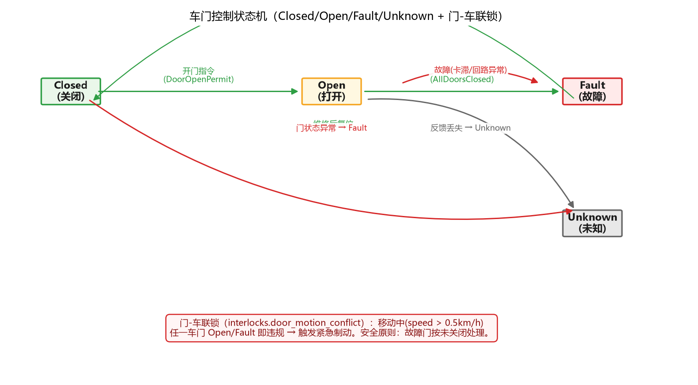
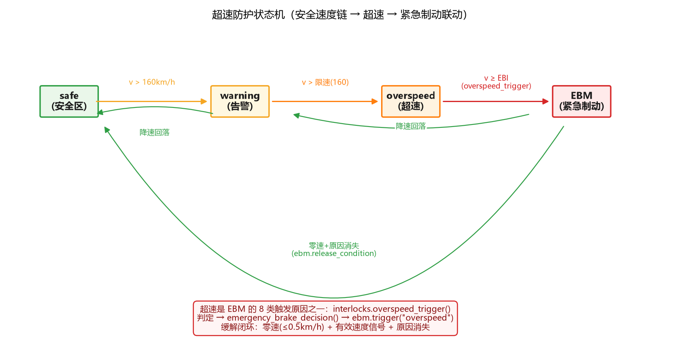

# TCMS-CAN-Test — 列车网络控制（TCMS）CAN 报文自动化测试框架

[](https://github.com/zych2002918/tcms-can-test/actions)
[](#)
[](https://github.com/zych2002918/tcms-can-test/blob/main/LICENSE)
[](#)
[](#)

针对轨道交通列车网络控制系统（TCMS / 列车控制管理系统）的 CAN 总线报文自动化测试框架。

通过**虚拟 CAN 总线 + DBC 协议数据库 + 报文仿真器（被测对象 DUT）**，对列车控制报文的
**周期、ID 合法性、信号值域、边界值、枚举、事件联动、丢报检测、安全联锁逻辑、紧急制动管理
（决策/执行/硬线回路三层）、CAN 错误状态机、事件时序记录、总线负载率与可调度性**进行自动化
验证，输出结构化测试报告。无硬件依赖，可本地运行，可接入 CI，可切换真实 CAN 硬件做 HIL。

```
┌─────────────────────┐  发送  ┌──────────────────┐  采集/断言   ┌─────────────────┐
│  TCMSNodeSimulator   │ ─────▶ │ 虚拟 CAN 总线       │ ───────────▶ │ pytest 测试套件    │
│  MultiNodeSimulator  │        │ (python-can virtual)│             │  658 个用例       │
│  （被测系统 DUT）    │        └──────────────────┘             └─────────────────┘
└─────────────────────┘          故障注入：节点失活 / 停止发送 / 越界 / 抖动 / 事件 / 总线错误 / 总线级短路断路
```

<div align="center">


*时序甘特图动画：帧 × 安全事件统一时间线（EBM 触发 / 错误状态迁移 / EBR 回路事件）*

</div>

## 功能特性

| 模块 | 说明 |
|------|------|
| `dbc/tcms.dbc` | 列车控制网络协议数据库：8 个报文（心跳/车速/牵引制动/车门/报警/受电弓/制动/能源），含周期属性与枚举值表 |
| `tcms/simulator.py` | 单节点 TCMS 仿真器：按 DBC 周期（50/100/500ms）自动发送周期报文，支持事件报文与故障注入 |
| `tcms/multinode.py` | **多节点总线仿真**：VCU（主控）/BCU（制动）/BMS（能源）独立节点，支持节点级失活与恢复（断电/通信中断场景） |
| `tcms/interlocks.py` | 列车安全联锁逻辑（测试视角规则）：门-车联锁、超速-制动联锁、受电弓异常、能源联锁、牵引-制动互锁、方向-速度联动、车门-站台联动 |
| `tcms/ebm.py` | **紧急制动管理（EBM）**：驾驶模式×制动原因×处置矩阵决策 + 司机缓解操作序列 + 缓解/复位闭环，SIL2/SIL4 双通道表决 |
| `tcms/ebr.py` | **EBR 硬线回路仿真**：独立于 CAN 的 SIL4 执行路径，串联常闭触点（得电缓解/失电制动）+ 断线诊断 + 双回路 2oo2 冗余 |
| `tcms/exec_feedback.py` | **EB 执行反馈闭环**：制动缸压力 + EB 回执 + 牵引切除联锁三重证据确认，超时/联锁违背判执行层故障 |
| `tcms/errstate.py` | **CAN 错误状态机**：对标 ISO 11898-1 的 TEC/REC 错误计数器、Error-Active/Passive/Bus-Off 迁移、128 次总线空闲恢复 + 恢复后 8 位发送退避（suspend transmission）、损坏帧统计 |
| `tcms/recorder.py` | **事件时序记录器**：环形缓冲统一时间线（帧/EBM/错误事件），RecordedBus 装饰器、过滤查询、统计、JSON/CSV 导出、**事故冻结窗口**（EB 触发前后快照，黑匣子语义） |
| `tcms/busload.py` | **总线负载率统计与压测**：位级帧模型（含最坏位填充）、滑动窗口负载率、设计上限评估、背景流量规划 |
| `tcms/schedulability.py` | **WCRT 可调度性分析**：Tindell 迭代最坏响应时间、总线利用率、ID 分配审计（安全报文优先级） |
| `tcms/bus.py` | **硬件接口层抽离**：`make_bus()` 读环境变量切换 virtual/PCAN/Vector/socketcan，`hardware` marker 隔离真实硬件用例 |
| `scripts/plot_timeline.py` | **时序甘特图**：时间×帧ID/事件泳道可视化（matplotlib，输出 docs/timeline_demo.png） |
| `tcms/parser.py` | 报文采集与解码辅助：周期统计、丢报检测 |
| `tcms/busfault.py` | **总线级故障注入**：短路/断路 → 全体节点集体 Bus-Off → 恢复；干扰 → REC 上升（共享介质故障影响所有节点） |
| `tcms/jitter.py` | **周期抖动/漂移统计**：帧间隔 min/max/mean/σ、ppm 长期漂移、迟到事件计数、漂移告警（>200ppm） |
| `tcms/seqcheck.py` | **报文序列/时序违规检测**：丢帧（超时）、重复帧、乱序帧、迟到帧，流式判定 + 多 ID 隔离 |
| `tcms/voting.py` | **2oo3 速度表决**：三通道多数一致表决，单通道故障自动降级 2oo2（容错演进，降级事件计数）、<2 通道表决失效（对标真实列控速度传感器冗余） |
| `tcms/faultlevel.py` | **故障分级模型**：轻微/一般/严重/灾难四级 → 处置映射（提示/告警/降级/紧急制动）+ 故障注入编排器（叠加/升级/影响评估） |
| `tcms/atp.py` | **ATP 超速监督分层**：警告/SBI/EBI 三级干预阈值 + 动态 EBI 曲线（目标点限速线性逼近，对标 ETCS 速度监督） |
| `tcms/nmt.py` | **CANopen NMT 心跳层（CiA 301）**：心跳生产者（boot-up + 状态字节）+ 消费者（3 周期超时判心跳丢失）+ **NMT 主站命令**（Start/Stop/Pre-op/Reset，命令审计日志） |
| `tcms/bypass.py` | **隔离/旁路开关状态机**：维护旁路安全前提（零速+速度信号有效）+ 操作审计日志 + 隔离组聚合（任一旁路→强制 RM 降级兜底，禁止升模式） |
| `tcms/canlog.py` | **CAN 日志解析与回放**：Vector .asc 格式解析（hex/dec、DLC 校验）+ 时间戳回放 + 日志统计（真实数据驱动验证入口） |
| `tcms/replay.py` | **完整回放链**：`.asc` → 虚拟时钟 → 联锁/ATP/看门狗/EBM → 告警断言（真实数据驱动回归，黑匣子语义闭环） |
| `tcms/timebase.py` | **虚拟时间基**：`VirtualClock` 确定性推进/跳变，全局统一时间源（HIL 平台时间一致性基础设施） |
| `tcms/faultlife.py` | **故障生命周期台账**：注入→传播→告警→恢复→归档五阶段闭环 + 场景 DSL（`when/expect` 声明式故障场景） |
| `tcms/scenarios.py` | **场景 YAML 外部化**：`scenarios/*.yaml` 声明式故障场景（场景与代码分离，测试/演示人员免改代码编排故障注入） |
| `tcms/network.py` | **多网段拓扑**：`BusNetwork` 命名网段 + `Gateway` 异步缓冲网关（接收 FIFO + 转发时延 + 溢出丢弃 + 白名单/黑名单过滤 + 足迹防环）+ 级联扩散 + 转发统计/审计日志 |
| `tests/` | **658 个自动化用例**，覆盖十八层：协议静态验证、仿真器行为、故障注入与边界值、安全联锁逻辑、多节点总线、紧急制动管理、EBR 硬线回路、EB 执行反馈、CAN 错误状态机、总线级故障注入、时序质量（抖动/序列）、故障分级、ATP 超速监督、NMT 心跳、2oo3 表决、负载率与可调度性、端到端故障链（突发负载→WCRT 超限→丢帧→看门狗→EBM）、隔离/旁路开关、CAN 日志回放、故障生命周期台账、虚拟时间基、完整回放链、场景 YAML、多网段拓扑 |

## 快速开始

```bash
python -m venv .venv
.venv/Scripts/activate            # Windows；Linux/macOS: source .venv/bin/activate
pip install -r requirements.txt
python run.py                     # 运行全部测试 + 生成 report.html
```

一键入口：

```bash
python run.py                     # 全部测试 + HTML 报告
python run.py --allure            # 额外生成 Allure 结果
python run.py --coverage         # 生成代码覆盖率报告（htmlcov/）
python run.py -k door             # 按关键字筛选用例
python run.py --no-report         # 只跑测试
python run.py --replay log.asc    # 回放真实 CAN 日志（.asc 格式）并统计
```

生成 Allure 报告（需安装 [allure 命令行](https://allurereport.org/docs/install/)）：

```bash
pytest tests/ --alluredir=allure-results
allure serve allure-results
```

## 测试用例设计（658 个）

**协议静态验证（`test_protocol.py`）**：DBC 结构完整性、报文 ID 唯一性与标准帧约束、
DLC、周期属性（50/100/500ms）、报警事件型配置、信号物理值域（车速 0-200km/h、
SOC 0-100%、温度 -40~120℃）、枚举值表、节点表。

**仿真器行为（`test_simulator.py`）**：7 个周期报文在总线上齐发、心跳/手柄周期实测、
心跳计数器单调递增、车速设置-解码往返一致、牵引/制动联动逻辑、车门状态与
AllDoorsClosed/开门许可联动、报警事件触发与解码、丢报注入。

**故障注入与边界值（`test_fault_injection.py`）**：车速/手柄/SOC/温度边界值编码与
越界拒绝、超速→报警事件联动（>160km/h）、心跳丢失检测、单报文丢失不影响其他报文、
时钟抖动下计数器完整性、车门故障安全（AllDoorsClosed 不得置位）、原始帧往返无损、
未知报文 ID 拒绝解码。

**安全联锁逻辑（`test_interlocks.py`）**：门-车联锁（开门/故障状态下移动即违规）、
超速判定边界（160km/h 含等于不触发）、紧急制动决策矩阵、受电弓拉弧风险
（电压异常 + 弓升）、SOC 能源联锁。

**多节点总线（`test_multinode.py`）**：节点-报文归属映射完整性、节点级失活隔离
（BMS 失活仅影响能源报文）、BCU 失活隔离、节点恢复后报文重新出现、未知节点拒绝。

**紧急制动管理（`test_ebm.py`）**：模式×原因矩阵穷举（8 原因 × FAM/CM/RM 3 模式）、
触发→缓解→复位闭环、司机缓解操作序列（手柄回零 + 缓解按钮保持 ≥3s）、自愈复位限次与
远程复位、降级链模式迁移（FAM→CM→RM 单步合法、跳级拒绝）、SIL2/SIL4 双通道表决、
非法输入健壮性。

**EBR 硬线回路（`test_ebr.py`）**：触点开路→失电→制动（fail-safe 方向）、断线 vs 请求源
诊断推理、diag_pulse 自检、双回路 2oo2（任一失电即制动、单断线降级不损失制动能力）、
未知触点/同一实例拒绝。

**EB 执行反馈（`test_exec_feedback.py`）**：三重证据（压力+回执+牵引切除）齐备才确认
执行、证据到达顺序无关、压力阈值边界、反馈超时判执行层故障（缺项明细）、
APPLIED 中牵引恢复→联锁违背立即故障、缓解压力回落、时间单调性（乱序/重放防护）、
故障态粘滞与维护复位。

**CAN 错误状态机（`test_errstate.py`）**：TEC/REC 计数规则（+8/-1/被动跳变 120/119）、
Error-Passive 阈值迁移（128）、Bus-Off 触发（TEC≥256）与离线隔离、128 次总线空闲恢复、
计数器 8 位封顶、错误类型统计、状态迁移回调、混合错误-成功震荡、软件复位。

**事件时序记录器（`test_recorder.py`）**：环形缓冲容量与淘汰、类型/ID/方向/类别/时间段/
关键词过滤查询、统计聚合、JSON/CSV 导出（UTF-8 无 BOM）、RecordedBus 收发帧透明记录、
EBM/错误状态机 hook 接线、统一时间线完整性与可序列化。

**总线负载率（`test_busload.py`）**：位级帧模型锚点（0 字节=55 位、8 字节=135 位最坏值）、
滑动窗口负载率收敛、设计上限/预警线评估、背景流量规划（30/60/90% 目标）、
高负载→低优先级帧劣化机制。

**可调度性（`test_schedulability.py`）**：WCRT 无干扰=R=C、高优先级干扰迭代、
饱和导致不可调度、抖动放大干扰、真实 DBC 报文集全可调度、利用率口径、
ID 分配审计（安全报文须占最低 ID 段，识别 BrakeSystem 0x700 风险点）。

**硬件接口层（`test_bus.py`）**：环境变量配置读取、virtual 总线创建、覆盖项透传、
非法位速率拒绝、`hardware` marker 隔离（CI 自动跳过）。

**属性测试（`test_properties.py`，hypothesis）**：以不变量验证替代逐例验证——
错误计数器范围与账目恒等、Bus-Off 隔离与恢复归零、状态-计数一致性、
EBM 触发-适用性-动作逐项吻合、任意操作序列后模式/状态合法、联锁违规⟺原因非空、
阈值单调、EBR fail-safe 与诊断一致、双回路 2oo2 降级、执行反馈状态机合法性与
故障态粘滞、证据完备才确认、环形缓冲容量上限与查询只读性。

**总线级故障注入（`test_busfault.py`）**：短路/断路 → 全体节点集体 Bus-Off（共享介质
故障影响所有节点）、恢复后全部回 Error-Active、干扰 → REC 上升不触发 Bus-Off、
故障期间禁止重复注入、部分空闲恢复保持 Bus-Off（128 位达标才恢复）。

**时序质量（`test_jitter.py` + `test_seqcheck.py`）**：帧间隔 min/max/mean/σ 统计、
迟到事件计数与容忍边界、ppm 漂移（慢/快时钟 ±1000ppm）与 200ppm 告警阈值、
时间戳回退拒绝；报文序列检测——乱序（跳号/回退）、重复帧（同序号短间隔）、
迟到帧（超容忍）、丢帧（超时）、多 ID 序列隔离、计数器回绕合法。

**故障分级模型（`test_faultlevel.py`）**：四级故障（info/minor/major/critical）分类、
模式敏感处置（critical 任何模式紧急制动、major 在 RM 下仅告警）、
处置优先级合并、注入编排器（叠加/升级/清除/影响评估报告）。

**ATP 超速监督（`test_atp.py`）**：警告/SBI/EBI 三级阈值边界（等于不触发、超限即 EBI）、
速度无效不监督、自定义阈值；动态 EBI 曲线——目标点限速线性逼近、允许速度
单调且封顶当前速度、制动触发点反解、参数校验。

**CANopen NMT 心跳（`test_nmt.py`）**：生产者 boot-up + 状态字节、COB-ID（0x700+node_id）、
node_id 边界校验、状态迁移；消费者 3 周期超时判心跳丢失、boot-up 重置计时、
复位语义；生产者→消费者闭环集成。

**2oo3 速度表决（`test_voting.py`）**：三通道一致/多数一致取均值、容差边界、
发散判定、单通道故障忽略、双通道故障表决器失效、故障清除恢复、自定义容差。

**虚拟时间基（`test_timebase.py`）**：`VirtualClock` 默认 monotonic 模式、
virtual 模式 advance/set 确定性推进、负值拒绝、virtual-only 限制、模式切换、
全局单例替换（仿真全链路统一时间源）。

**故障生命周期台账（`test_faultlife.py`）**：五阶段迁移（注入→传播→告警→
恢复→归档）、同名幂等复用、未开账/已归档拒绝、recorder 事件联动、审计报告
（total/open/closed/by_level）、场景 DSL——`when(节点, 故障, at=时刻, expect=动作)`
声明式故障场景 + `expect_clear` 恢复断言，`ScenarioRunner` 按时间序执行并输出
断言报告。

**完整回放链（`test_replay.py`）**：`.asc` 帧 → 虚拟时钟 → 联锁/ATP/看门狗/EBM
全链路驱动——正常行驶无告警、超速(>160)→EBI 触发 EBM+ATP 告警、门开移动触发
联锁告警、心跳丢失→看门狗 fault、recorder 联动、报告结构完整（帧数/告警分类/
EBM 状态/看门狗状态/ATP 级别）。

**场景 YAML 外部化（`test_scenarios.py`）**：`parse_scenario`/`load_scenario`/
`run_yaml`/`run_scenarios` 一键加载执行；YAML 语法与 `FaultScenario.when()/
expect_clear()` 一一对应（显式 `inject/recover` 与事件式 `action` 两种写法）、
缺 at/未知动作/空 YAML/无 steps/目录不存在均报错；`scenarios/*.yaml` 示例：
超速降级（inject major→expect derate→recover）、EB 失效（critical→expect
emergency_brake）、门故障级联（事件式写法）。

**多网段拓扑（`test_network.py`，30 用例）**：`BusNetwork` 多段构建（空拓扑拒绝）、
网关白名单（只转发允许 ID，空=全转发）/黑名单（拦截名单 ID）、无网关网段隔离、
**异步缓冲转发**（send 只入缓冲，时钟推进+`step()` 泵出，转发时延可测）、
**缓冲溢出丢弃新帧**（满则不阻塞发送方）、级联扩散（propulsion→brake→doors，
逐网关两拍到达）、**足迹防环**（帧不重复过同一网关，双向网关回环一次即止）、
转发统计/溢出计数/缓冲占用与审计日志深拷贝、热插拔段、`recv_any` 跨段统一
接收（阻塞轮询全段）、发送/转发失败容错（can.CanError → 返回 False /
日志 forwarded=False）、负时延/零容量拒绝、未知段拒绝。

## 紧急制动管理（EBM）

对标真实 TCMS 的"紧急制动原因表"：同一原因在不同驾驶模式下处置不同，
紧急制动决策按 **模式 × 原因处置矩阵** 查表，并完成"触发 → 缓解 → 复位"闭环。
对应降级链：ATO 故障 FAM→CM，ATP 故障 CM→RM（不允许跳级）。

| 原因 | FAM | CM | RM | 处置 | SIL |
|------|-----|-----|-----|------|-----|
| 超速 overspeed | ✔ | ✔ | ✔ | 紧急制动 | 4 |
| 车门打开 door_open | ✔ | ✔ | ✘ | 紧急制动 | 4 |
| ATO 故障 ato_fault | ✔ | ✘ | ✘ | 紧急制动 + 降级 CM | 2 |
| ATP 故障 atp_fault | ✔ | ✔ | ✘ | 紧急制动 + 降级 RM | 4 |
| 障碍物 obstacle | ✔ | ✔ | ✘ | 紧急制动 | 4 |
| 火灾报警 fire_alarm | ✔ | ✔ | ✔ | 紧急制动 | 2 |
| 维护开关 maintenance_sw | ✔ | ✔ | ✔ | 紧急制动 | 4 |
| 网络丢失（硬线备份）hardwire_loss | ✔ | ✔ | ✔ | 紧急制动 | 4 |

> ✘ = 原因不适用于该模式：只记录提示（`record_only`），**不误制动**。
>
> 设计说明（面试点）：RM（限制人工）模式下车门/障碍物类原因豁免矩阵制动，理由是 RM 由司机人工确认操作（对标真实列控的运营豁免）；但豁免不等于无防护——`interlocks.py` 的门-车联锁仍按"故障门不得移动"兜底，两层防护职责分离。

**缓解/复位闭环**：

```
         (适用原因触发)                 (零速 ≤0.5km/h 且原因消失)      (远程/人工复位)
IDLE ─────────────────────▶ BRAKE ───────────────────────────────▶ RELEASED ──────────▶ IDLE
 ▲                           │  ▲
 │        (自愈复位·限1次)      │  │ (第 2 次自愈被拒)
 └───────────────────────────┘  ▼
                            FAULT ──────(远程复位)──────▶ IDLE
```

**司机缓解操作序列**（对标真实 EB 缓解的两步操作）：BRAKE 且零速且原因消失后，
第一步司机手柄回零（`prepare_release`，未回零拒绝）→ WAIT_HANDLE_ZERO；
第二步按下缓解按钮保持 ≥3 秒（`hold_release_button`，不足可重试）→ IDLE。
运行中/原因未消时序列禁止启动——"不消原因不停车不缓解"。

**双通道表决设计**（面试亮点）：
- **SIL4**（超速/ATP 故障/门开等）：两路独立通道**任一触发即制动**——故障安全，
  制动的失效代价远高于误制动，宁可错杀不可漏放；
- **SIL2**（ATO 故障/火灾报警）：**双通道一致才制动**——防误报，
  避免传感器偶发噪声导致无谓紧急制动；

**自愈策略**：自愈复位限 1 次，超限转入 FAULT，之后必须远程/人工复位——
对标真实系统的恢复策略。

## EBR 硬线回路（ebr）

真实列车的紧急制动请求走**硬线回路**而非 CAN：通信网络可能故障（节点 Bus-Off、
线缆破损），SIL4 安全功能的执行路径必须独立于可失效的通信介质。回路
**得电=缓解、失电=制动**，建模为串联常闭触点（司机手柄 / ATP 触点 / 紧急按钮）：

- 任一触点开路（制动请求）→ 回路失电 → 制动施加（fail-safe：故障方向=制动方向）；
- 物理断线：请求源全闭合但回路仍失电 → 诊断推理为断线（`diag_pulse`），
  与"触点开路的正常请求"区分——诊断逻辑与列车 EBR 回路监测一致；
- 双回路 2oo2 冗余：任一失电即制动；单条断线只产生检修预警（`degraded`），
  另一条回路仍保证制动能力。

## EB 执行反馈闭环（exec_feedback）

EBM 发出紧急制动请求只是**决策**，制动是否真正施加必须由执行层反馈确认——
"决策正确"不能推导出"列车已安全停车"。三条反馈证据交叉校验：

1. **制动缸压力**（DBC `BrakeSystem.BrakeCylinderPressure`）达到施加阈值 300 kPa；
2. **EB 激活回执**（`EmergencyBrakeActive`）BCU 确认；
3. **牵引切除联锁**：执行期间牵引必须保持切除。

任一证据缺失（超时窗口 2s）→ 执行层故障；**APPLIED 期间牵引恢复 = 联锁违背，
立即判故障不等超时**——边制动边牵引是执行层最危险的失效。缓解同样需压力回落到
释放阈值以下才确认；所有反馈样本做时间单调性校验（拒绝乱序/重放）。

## CAN 错误状态机（errstate）

对标 **ISO 11898-1 错误管理**：每个节点维护发送错误计数 TEC 与接收错误计数 REC，
按计数落入 Error-Active / Error-Passive / Bus-Off 三态。规则与标准对齐：

| 事件 | TEC 变化 | REC 变化 |
|------|---------|---------|
| 检出发送错误 | +8 | — |
| 检出接收错误 | — | +8 |
| 成功发送（TEC<128） | −1 | — |
| 成功发送（TEC≥128） | 置 120（被动快速回归） | — |
| 成功接收（REC≥128） | — | 置 119（被动快速回归） |
| TEC ≥ 256 | **Bus-Off**（8 位封顶 255 存储） | — |
| Bus-Off 后累计 128 次总线空闲 | 归零复位 Error-Active | 归零复位 |

设计要点：
- **Bus-Off 离线隔离**：Bus-Off 期间节点不感知总线，所有事件注入均为 no-op——
  对真实节点"离线即失聪"的行为建模；
- **接收错误不触发 Bus-Off**（ISO 11898-1：Bus-Off 仅由发送错误引发）；
- 按错误类型（位/填充/CRC/格式/ACK）统计损坏帧——对应 CANoe 等工具的总线错误统计；
- 状态迁移回调（`on_state_change` / `add_state_listener`）供记录器/监控接线。

## 总线负载率与可调度性（busload + schedulability）

对标 CANoe Statistics 窗口与整车厂负载率设计规范（控制 CAN 典型上限 30~50%），
提供**网络级系统性指标**——不只是"测了多少种故障"，而是"总线还有多少容量余量"：

- **位级帧模型**：SOF+仲裁+CRC+ACK+EOF+IFS+位填充（最坏情况 floor((L-1)/4)），
  锚点验证：0 字节帧 55 位、8 字节帧 135 位（业界公认值）；
- **滑动窗口负载率**：逐帧喂入、即时输出窗口平均负载，与设计上限/预警线对比评估；
- **WCRT 可调度性分析**（Tindell 迭代）：R = B + C + Σ⌈(R+τ+Jⱼ)/Tⱼ⌉Cⱼ，
  逐报文断言 R ≤ 周期（deadline），识别高负载下低优先级报文的周期劣化；
- **ID 分配审计**：CAN 按 ID 仲裁优先级，安全报文必须占最低 ID 段——
  本项目 DBC 中 BrakeSystem（0x700）优先级低于 VehicleSpeed（0x200）即是
  可被审计工具识别的真实风险点（演示"发现风险"的过程比"无风险"更有含金量）。

## 硬件接口层（bus）

CI 环境用 python-can virtual 接口做确定性回归；HIL/台架接入真实 CAN 卡时
**只改环境变量、不改任何代码**——同一套用例两种执行环境：

```bash
# Linux 上 socketcan；Windows 上 PCAN/Vector
export TCMS_BUS_INTERFACE=socketcan
export TCMS_BUS_CHANNEL=can0
export TCMS_BUS_BITRATE=250000
pytest tests/ -m hardware      # 真实硬件用例（CI 中自动跳过）
```

## 事件时序记录器（recorder）

对标 CAN 分析工具的 Logging/Trace 与轨道交通信号系统"事件记录器"（EN 50128 语境下
安全事件的可追溯性）：**帧流量与安全事件共享一条统一时间线**。

- `EventRecorder`：环形缓冲（deque maxlen，长跑内存不膨胀），统一 `record_event` 入口；
- `RecordedBus`：python-can 总线装饰器，收发帧透明入库（节点/方向/DLC/数据十六进制）；
- `hook_ebm` / `hook_errstate`：把紧急制动动作与错误状态迁移接入时间线（模块零改动，
  职责单向）；
- 过滤查询（类型/仲裁 ID/方向/类别/时间段/关键词）、聚合统计（按类型/方向/ID/字节数）、
  JSON/CSV 导出（UTF-8 无 BOM，CSV 兼容 Excel）。

**可视化**：`scripts/plot_timeline.py` 时序甘特图（时间×帧ID/事件泳道，含 EBR 失电/得电事件标注）、`scripts/plot_state_machines.py` 状态机迁移图（EBM/ATP/错误状态机/车门控制/超速防护五图）、`scripts/make_demo_gif.py` 时序动画 GIF
（`docs/timeline_demo.png`），直观呈现"错误积累 → 制动触发 → 缓解"的安全事件序列与
总线流量的时序关系。






## 后续规划

- [x] CRC-8 校验与错误/位翻转注入
- [x] 节点生命周期状态机
- [x] 紧急制动管理（模式×原因×处置矩阵 + 缓解/复位闭环 + 司机缓解序列，SIL2/SIL4 双通道表决）
- [x] EBR 硬线回路（得电缓解/失电制动 + 断线诊断 + 2oo2 冗余）
- [x] EB 执行反馈闭环（压力+回执+牵引切除三重证据）
- [x] CAN 错误状态机（TEC/REC、Bus-Off）仿真（对标 ISO 11898-1）
- [x] 事件时序记录器（环形缓冲统一时间线 + 过滤查询 + JSON/CSV 导出）
- [x] 时序甘特图可视化（时间×帧ID/事件泳道）
- [x] 状态机迁移图（EBM/ATP/错误状态机）+ 时序动画 GIF
- [x] 工程化标准化（pyproject.toml + 开源三件套 + run.py --replay 回放入口）
- [x] 隔离/旁路开关状态机 + 事故冻结窗口 + 2oo3→2oo2 降级 + NMT 主站命令
- [x] 总线负载率统计与压测（位级帧模型 + 滑动窗口）
- [x] WCRT 可调度性分析（Tindell 迭代 + ID 分配审计）
- [x] 硬件接口层抽离（环境变量切换 + hardware marker）
- [x] 超速监督分层与动态 EBI 曲线（警告/SBI/EBI 三级 + 动态 EBI 曲线）
- [x] 周期抖动/漂移统计（帧间隔 min/max/mean/σ + ppm 漂移 + 告警阈值）
- [x] CANopen NMT 心跳层（CiA 301，轨道车辆常用）
- [x] 总线级故障注入（短路/断路 → 集体 Bus-Off → 恢复）
- [x] 报文序列/时序违规检测（丢帧/重复/乱序/迟到）
- [x] 故障分级模型（四级映射处置 + 注入编排器）
- [x] 2oo3 速度表决（三通道多数一致 + 故障容忍）
- [x] 列车门控/超速逻辑状态机可视化（`state_door.png` 门控 + `state_overspeed.png` 超速防护）
- [x] 安全论证文档（`docs/safety_case.md`，EN 50128 SR-01~15 映射）
- [x] 完整回放链（`tcms/replay.py`：.asc → 虚拟时钟 → 联锁/ATP/看门狗/EBM → 告警断言）
- [x] 虚拟时间基（`tcms/timebase.py`：VirtualClock 确定性推进，HIL 时间一致性基础设施）
- [x] 故障生命周期台账 + 场景 DSL（`tcms/faultlife.py`：五阶段闭环 + when/expect 声明式场景）
- [x] 场景 YAML 外部化（`tcms/scenarios.py` + `scenarios/*.yaml`）
- [x] 多网段拓扑（`tcms/network.py`：BusNetwork + Gateway ID 过滤 + 级联转发防环）
- [x] 教学教程（`docs/tutorial.md`：从零到一完整学习主线）
- [x] 面试讲解（`docs/interview_guide.md`：60 秒 STAR 叙事 + 六层话术 + 高频追问 Q&A + 数字速查卡）
- [ ] 真实 CAN 硬件联调（PCAN / 周立功，框架已就绪待插卡）

## 说明

本项目为学习/求职展示用途的轨道交通测试工具，报文协议为模拟设计，非真实车型协议。
